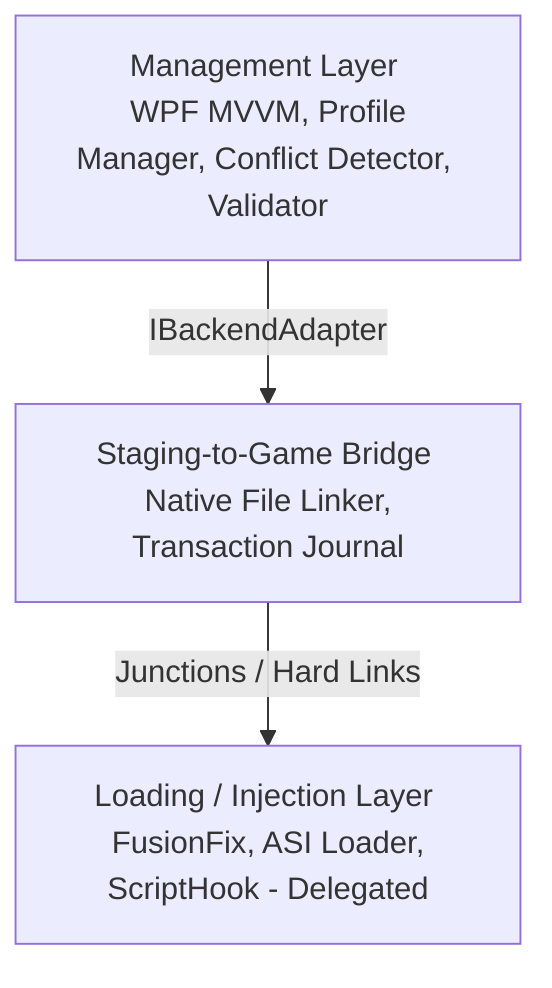

[](https://github.com/Asterinos1/ManagerIV)
[](https://github.com/Asterinos1/ManagerIV)
[](https://github.com/Asterinos1/ManagerIV)

# ManagerIV — GTA IV Mod Loader

**ManagerIV** is a transaction-safe, Fluent UI-driven mod manager for **GTA IV: Complete Edition** on Windows. It orchestrates community loaders, including FusionFix, Ultimate ASI Loader, and ScriptHook, and manages mod files dynamically without modifying original game files.

---

## Getting Started

### Prerequisites
* **Runtime**: .NET 8 SDK or Desktop Runtime.
* **Operating System**: Windows 10 or 11 with NTFS formatted drives (required for directory junctions and hard links).

### Installation and Execution
<details>
<summary>Click to view step-by-step installation instructions</summary>

1. **Clone the Repository**:
   Clone the repository to your local drive.
2. **Build and Run**:
   Open a terminal (PowerShell) in the root directory and execute:
   ```powershell
   dotnet run --project src/ManagerIV/ManagerIV.csproj
   ```
   *(Reference: [ManagerIV.csproj](file:///C:/Users/PC/Documents/GitHub/Side-Hustle/src/ManagerIV/ManagerIV.csproj))*
3. **Execute Unit Tests**:
   Verify the installation by running the test suite:
   ```powershell
   dotnet test ManagerIV.sln
   ```
   *(Reference: [ManagerIV.sln](file:///C:/Users/PC/Documents/GitHub/Side-Hustle/ManagerIV.sln))*
</details>

---

## Core Directive: Zero Mutation

> [!IMPORTANT]
> **Zero-Mutation Policy**: ManagerIV enforces a strict zero-mutation policy on original game directory files. The application deploys mod assets via NTFS directory junctions and hard links, preventing conflicts with Steam file verification.

* **Dynamic Linking**: Employs NTFS directory junctions (cross-drive, no elevation) and hard links (same-volume, zero duplication) to map files into the game structure dynamically.
* **Steam Verification Compatibility**: Since original files are untouched, Steam verification will never conflict with or delete the mod configuration.
* **Tracked Binaries**: Only key backend bootstrapper files (e.g., `dinput8.dll`) are written to the game directory. These files are tracked in a manifest for rollback support.

---

## Architecture and Framework

The application separates concerns across three decoupled layers:



* **Management Layer**: Manages mod metadata and detects profile conflicts using [ProfileManager](file:///C:/Users/PC/Documents/GitHub/Side-Hustle/src/ManagerIV/Core/ProfileManager.cs), [ConflictDetector](file:///C:/Users/PC/Documents/GitHub/Side-Hustle/src/ManagerIV/Core/ConflictDetector.cs), [UpdateFolderValidator](file:///C:/Users/PC/Documents/GitHub/Side-Hustle/src/ManagerIV/Core/UpdateFolderValidator.cs), and [ModStructureAnalyzer](file:///C:/Users/PC/Documents/GitHub/Side-Hustle/src/ManagerIV/Core/ModStructureAnalyzer.cs).
* **Staging-to-Game Bridge**: Bridges staging paths to the game directory using [IFileSystemLinker](file:///C:/Users/PC/Documents/GitHub/Side-Hustle/src/ManagerIV/Core/IFileSystemLinker.cs), [NativeFileSystemLinker](file:///C:/Users/PC/Documents/GitHub/Side-Hustle/src/ManagerIV/Core/NativeFileSystemLinker.cs), and [TransactionJournal](file:///C:/Users/PC/Documents/GitHub/Side-Hustle/src/ManagerIV/Core/TransactionJournal.cs).
* **Loading Layer**: Interfaces with native game loaders using [IBackendAdapter](file:///C:/Users/PC/Documents/GitHub/Side-Hustle/src/ManagerIV/Core/IBackendAdapter.cs) and [CompleteEditionAdapter](file:///C:/Users/PC/Documents/GitHub/Side-Hustle/src/ManagerIV/Core/CompleteEditionAdapter.cs).

---

## Core Components and Staging Map

| Component | Class / Interface | Responsibility |
| :--- | :--- | :--- |
| **Profile Manager** | [ProfileManager](file:///C:/Users/PC/Documents/GitHub/Side-Hustle/src/ManagerIV/Core/ProfileManager.cs) | Serializes and loads profile configurations. |
| **Conflict Detector** | [ConflictDetector](file:///C:/Users/PC/Documents/GitHub/Side-Hustle/src/ManagerIV/Core/ConflictDetector.cs) | Scans enabled mods and identifies file overrides. |
| **Staging Bridge** | [IFileSystemLinker](file:///C:/Users/PC/Documents/GitHub/Side-Hustle/src/ManagerIV/Core/IFileSystemLinker.cs) | Abstracts native junctions and hard link creation. |
| **Log Linker** | [CompleteEditionAdapter](file:///C:/Users/PC/Documents/GitHub/Side-Hustle/src/ManagerIV/Core/CompleteEditionAdapter.cs) | Translates logical load order into the physical directory tree. |

### Mod Deployment Targets

| Target | Game Folder Location | Mod Binary Type |
| :--- | :--- | :--- |
| **Update** | `update/` | Raw replacement files and FusionOverloader mods |
| **Plugins** | `plugins/` | ASI loaders and `.asi` plugins |
| **Scripts** | `scripts/` | ScriptHook plugins and `.dll` assemblies |

---

## System Features

### Core File System Bridge
* **Directory Junctions**: Employs directory junctions to route mod directories without requiring administrative rights.
* **Hard Links**: Links override files on the same volume to eliminate duplicated file storage.
* **Transaction Journal**: Utilizes [TransactionJournal](file:///C:/Users/PC/Documents/GitHub/Side-Hustle/src/ManagerIV/Core/TransactionJournal.cs) to roll back filesystem operations in reverse order if deployment errors occur.

### Mod Management & Safety
* **Archive Extraction**: Extracts `.zip`, `.rar`, and `.7z` archives sequentially, incorporating Zip-Slip traversal protection.
* **Asset Size Guard**: Flags oversized assets to enforce engine compatibility limits (134 MB limit for `.img` files, 2 GB limit for `.rpf` archives).
* **Update Watchdog**: Tracks the game executable's file size and hash using [UpdateWatchdog](file:///C:/Users/PC/Documents/GitHub/Side-Hustle/src/ManagerIV/Core/UpdateWatchdog.cs) to notify users of updates.

### Configuration Editors
* **FusionFix INI Editor**: Provides an interactive form interface with validation rules to parse and modify `GTAIV.EFLC.FusionFix.ini`.
* **Steam Reset**: Automatically purges staging folders to restore the directory to a vanilla state.

### Audio & Save Profile Managers
* **Independence FM Manager**: Builds track manifests, parses audio tags, and links custom files directly to user music directories.
* **Save Game Profile Switcher**: Swaps active user profile folders and manages independent save slots.
