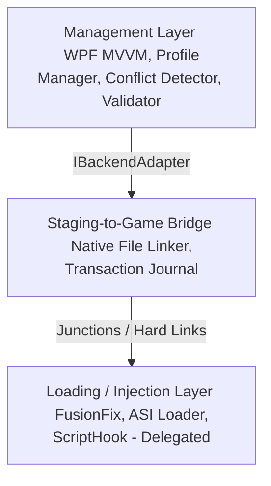

<div align="center">

# ManagerIV
**Comprehensive Mod, Tool, and Profile Manager for GTA IV.**

[](https://dotnet.microsoft.com/) [](https://docs.microsoft.com/en-us/dotnet/csharp/) [](https://github.com/lepoco/wpfui) [](https://github.com/octokit/octokit.net) [](https://github.com/Asterinos1/ManagerIV) [](https://opensource.org/licenses/MIT)

*This is a side project I've been working on for the past few months. The core idea was born out of my love for modding. I wanted to create a tool that allows you to easily experiment with mods (and more) without the hassle of drag-and-drop and breaking stuff.*

A comprehensive, Fluent UI-driven environment manager for **GTA IV: Complete Edition**. ManagerIV handles automated tool installations, safe mod deployments via zero-mutation file linking, and advanced features like save slots, DXVK scaling, and Independence FM manifest generation.

[Overview](#overview) • [Features](#features) • [Architecture](#architecture) • [Core Components](#core-components) • [Download](#download) • [Getting Started](#getting-started) • [Authors](#authors)

</div>

---

## Overview

ManagerIV orchestrates community loaders, including FusionFix, Ultimate ASI Loader, and ScriptHook, and manages mod files dynamically without modifying original game files. 

> [!IMPORTANT]
> ManagerIV enforces a strict zero-mutation policy on original game directory files. The application deploys mod assets via NTFS directory junctions and hard links, preventing conflicts with Steam file verification.

By employing NTFS directory junctions and hard links, the manager maps files into the game structure seamlessly across drives without requiring elevation or duplicating storage. Because original files remain untouched, Steam verification will never conflict with or delete your mod configuration. Only essential backend bootstrapper files, like `dinput8.dll`, are placed in the game directory, and these are meticulously tracked in a manifest for instant rollback support.

## Features

### Backend Tool Integration
ManagerIV automates the process of fetching and installing community loaders. It safely downloads FusionFix, Ultimate ASI Loader, and DXVK directly from GitHub releases by caching them locally and verifying their SHA-256 hashes using the [BackendToolManager](src/ManagerIV/Core/BackendToolManager.cs).

### Core File System Bridge
Instead of requiring administrative rights, the manager uses directory junctions to route mod directories seamlessly. For files on the same volume, it relies on hard links to prevent duplicated storage. If any deployment error occurs, the built-in [TransactionJournal](src/ManagerIV/Core/TransactionJournal.cs) rolls back all filesystem operations in reverse order, leaving no broken files behind.

### Mod Management & Safety
The application extracts `.zip`, `.rar`, and `.7z` archives sequentially while keeping you protected from Zip-Slip traversal vulnerabilities. It also guards against engine crashes by flagging oversized assets, such as `.img` files over 134 MB or `.rpf` archives over 2 GB. Whenever the game executable is updated, the [UpdateWatchdog](src/ManagerIV/Core/UpdateWatchdog.cs) tracks the file size and hash to notify you immediately.

### Configuration Editors
You can tweak `GTAIV.EFLC.FusionFix.ini` through an interactive form that validates your rules. It also dynamically generates and manages `dxvk.conf` to handle custom resolution scaling and optimizations. If things go wrong, a single steam reset command purges all staging folders and restores the directory to a vanilla state.

### Audio & Save Profile Managers
The manager extends beyond typical mods by building track manifests and parsing audio tags to link custom files directly to your user music directory for Independence FM. You can also easily swap active user profile folders and manage independent save slots.

## Architecture

The application separates concerns across three decoupled layers:



The Management Layer manages mod metadata and detects profile conflicts using [ProfileManager](src/ManagerIV/Core/ProfileManager.cs), [ConflictDetector](src/ManagerIV/Core/ConflictDetector.cs), [UpdateFolderValidator](src/ManagerIV/Core/UpdateFolderValidator.cs), and [ModStructureAnalyzer](src/ManagerIV/Core/ModStructureAnalyzer.cs). 

The Staging-to-Game Bridge safely links your staging paths directly to the game directory using [IFileSystemLinker](src/ManagerIV/Core/IFileSystemLinker.cs), [NativeFileSystemLinker](src/ManagerIV/Core/NativeFileSystemLinker.cs), and [TransactionJournal](src/ManagerIV/Core/TransactionJournal.cs). 

Finally, the Loading Layer interfaces directly with native game loaders through [IBackendAdapter](src/ManagerIV/Core/IBackendAdapter.cs) and [CompleteEditionAdapter](src/ManagerIV/Core/CompleteEditionAdapter.cs).

## Repository Structure

```text
.
├── src/
│   └── ManagerIV/
│       ├── Core/             # File system linkers, adapters, models
│       ├── ViewModels/       # UI ViewModels for Mod Library, Profiles, etc.
│       ├── Views/            # WPF UI Views
│       └── ManagerIV.csproj  # Main Application project
├── tests/
│   └── ManagerIV.Tests/      # Unit and integration test suite
├── .agents/                  # Development agent configuration files
├── ManagerIV.sln             # Visual Studio Solution File
└── README.md
```

---

## Download
**Coming Soon! (hopefully)**

You can download the latest version of ManagerIV from the [Releases page](https://github.com/Asterinos1/ManagerIV/releases/latest).

---

## Getting Started

### Prerequisites

To run ManagerIV, you will need the .NET 8 SDK or Desktop Runtime installed on a system running Windows 10 or 11. Your drives must be NTFS-formatted, as this is required for creating directory junctions and hard links.

### Installation and Execution

1. **Clone the Repository**:
   Clone the repository to your local drive.
   ```bash
   git clone https://github.com/Asterinos1/ManagerIV.git
   cd ManagerIV
   ```

2. **Build and Run**:
   Open a terminal (PowerShell) in the root directory and execute:
   ```powershell
   dotnet run --project src/ManagerIV/ManagerIV.csproj
   ```

3. **Execute Unit Tests**:
   Verify the installation by running the test suite:
   ```powershell
   dotnet test ManagerIV.sln
   ```

---

## Core Components

| Component | Class / Interface | Responsibility |
| :--- | :--- | :--- |
| **Profile Manager** | [ProfileManager](src/ManagerIV/Core/ProfileManager.cs) | Serializes and loads profile configurations. |
| **Conflict Detector** | [ConflictDetector](src/ManagerIV/Core/ConflictDetector.cs) | Scans enabled mods and identifies file overrides. |
| **Staging Bridge** | [IFileSystemLinker](src/ManagerIV/Core/IFileSystemLinker.cs) | Abstracts native junctions and hard link creation. |
| **Log Linker** | [CompleteEditionAdapter](src/ManagerIV/Core/CompleteEditionAdapter.cs) | Translates logical load order into the physical directory tree. |
| **Backend Manager** | [BackendToolManager](src/ManagerIV/Core/BackendToolManager.cs) | Fetches and installs community loaders from GitHub releases. |

### Mod Deployment Targets

| Target | Game Folder Location | Mod Binary Type |
| :--- | :--- | :--- |
| **Update** | `update/` | Raw replacement files and FusionOverloader mods |
| **Plugins** | `plugins/` | ASI loaders and `.asi` plugins |
| **Scripts** | `scripts/` | ScriptHook plugins and `.dll` assemblies |

---

## License and Legal

ManagerIV is released under the **MIT License**.

We rely on several incredible open-source projects, which use a variety of licenses (GPL-3.0, LGPL-2.1, zlib, MIT). ManagerIV complies with these licenses securely through runtime aggregation and dynamic linking. Loaders like FusionFix (GPL-3.0) and DXVK (zlib) are never modified or recompiled; instead, we simply fetch their compiled release binaries at runtime. Similarly, libraries like TagLibSharp (LGPL-2.1) are dynamically linked via standard NuGet DLLs. 
Because no source code is statically linked or modified, ManagerIV retains its MIT License safely.

### Acknowledgements

* **[GTAIV.EFLC.FusionFix](https://github.com/ThirteenAG/GTAIV.EFLC.FusionFix)** by ThirteenAG (GPL-3.0)
* **[Ultimate ASI Loader](https://github.com/ThirteenAG/Ultimate-ASI-Loader)** by ThirteenAG (MIT)
* **[DXVK](https://github.com/doitsujin/dxvk)** by doitsujin (zlib)
* **[WPF-UI](https://github.com/lepoco/wpfui)** by lepoco (MIT)
* **[Octokit.NET](https://github.com/octokit/octokit.net)** (MIT)
* **[SharpCompress](https://github.com/adamhathcock/sharpcompress)** (MIT)
* **[TagLibSharp](https://github.com/mono/taglib-sharp)** (LGPL-2.1)

---

## Authors

| [<br /><sub><b>Asterinos1</b></sub>](https://github.com/Asterinos1) |
| :---: |
