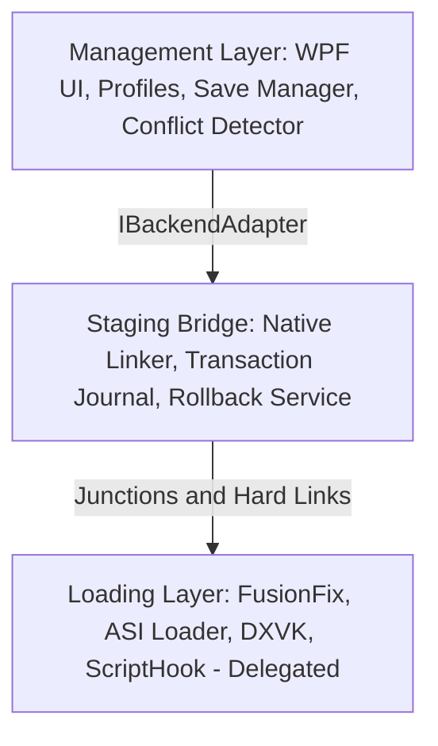

<div align="center">

# ManagerIV
A mod manager and profile loader for Grand Theft Auto IV: Complete Edition.

[](https://dotnet.microsoft.com/) [](https://docs.microsoft.com/en-us/dotnet/csharp/) [](https://github.com/lepoco/wpfui) [](https://github.com/octokit/octokit.net) [](https://github.com/Asterinos1/ManagerIV) [](https://opensource.org/licenses/MIT)

*This is a side project I've been working on for the past few months. Since I love modding games and GTA IV is one of my favourites, I decided to create an app that takes away the headache of manually dragging files around, editing configs by hand, and constantly reinstalling.*

[Overview](#overview) • [Features](#features) • [How ManagerIV Protects Your Game](#how-manageriv-protects-your-game) • [Technical Architecture](#technical-architecture) • [Getting Started](#getting-started) • [Credits](#credits)

</div>

---

## Overview

Modding Grand Theft Auto IV: Complete Edition on modern Windows has always been a fragile process. Traditional modding requires manually dropping files into the game folder and overwriting original files. When something breaks or two mods conflict, fixing it usually means verifying files through Steam and losing everything you set up. On top of that, running into engine bugs like the taxi bug or the 40-archive crash limit often leaves players guessing what went wrong.

ManagerIV solves this by keeping your mods completely separate from your game install. All your mod files live in a staging folder outside the game directory. When you activate a profile, ManagerIV links your mods into GTA IV using native Windows filesystem links. Original game files are never modified, overwritten, or deleted. If you ever want to turn off a mod or test a clean game, the links are removed instantly and your game folder stays pristine.

---

## Features

### Drag and Drop Mod Installation
Drop any `.zip`, `.rar`, or `.7z` archive or standalone `.asi` file into the window. ManagerIV inspects the archive contents, preserves folder structures for nested scripts, and sorts files where they belong:
- `update/` for textures, models, and game data replacements
- `plugins/` for ASI plugins and their `.ini` configurations
- `scripts/` for ScriptHook .NET script assemblies and companion folders

Load orders are fully customizable in the interface, allowing you to control which mod takes priority when multiple mods modify the same files.

### Built-in Configuration Editor
Instead of opening text editors to tweak `.ini` and `.conf` files by hand, ManagerIV includes a searchable settings editor right inside the app with support for three key tools:
- FusionFix settings such as recoil steering bias, camera sensitivity, shadow filters, volumetric fog, ambient occlusion quality, sun shafts, framerate ceilings, and episodic content toggles
- DXVK graphics settings covering Vulkan presentation, forced aspect ratios, frame rate caps, refresh rates, and Reflex low-latency sleep
- Liberty's Legacy Trainer options including hotkeys, controller shortcuts, god mode, wanted levels, speedometers, and time or weather freezes

ManagerIV also automatically configures `-availablevidmem`, `-nomemrestrict`, and `-norestrictions` in `commandline.txt` to fix the GTA IV 512 MB VRAM detection bug. To fix the notorious taxi bug where only taxis spawn on the road, the built-in vehicle budget calculator inspects your active `vehicles.img` file size and provides recommended memory pool presets.

### Automated Tool Downloads
ManagerIV downloads and updates essential community tools straight from official GitHub releases, checking SHA-256 cryptographic hashes before installation. Supported tools include FusionFix, Ultimate ASI Loader, and DXVK.

The app also features a dedicated installer for the Liberty's Legacy Trainer. It checks for prerequisites like an active ASI loader, tracks download progress, verifies archive integrity, and deploys the trainer into the game root. Bundled audio libraries like BASS (`bass.dll`) and MemBiter are also supported for mods that rely on them.

### Profiles and Save Game Slot Management
Set up separate profiles to swap between a vanilla playthrough, a graphically overhauled game, or script-heavy setups with one click. Each profile maintains its own mod list and tool configurations.

The built-in save manager allows you to inspect save slots, manage independent save folders across profiles, and import single `.sav` files directly into specific save slots (slots 1 through 12) with overwrite warnings so you never lose game progress.

### Custom Radio Station Studio
An integrated music manager makes it easy to set up your custom soundtrack for GTA IV's Independence FM radio station. Powered by TagLibSharp, it reads audio tags (artist, title, album, bitrate), checks format compatibility, lets you preview songs directly in the app, and builds clean playlists for the game.

### Safety Guards and Engine Limit Alerts
GTA IV crashes if you load more than 40 `.img` archives. ManagerIV monitors the total number of active `.img` archives across all enabled mods and alerts you before reaching that ceiling. An update watchdog also checks your `GTAIV.exe` version, byte size, and hash against your profile snapshot, letting you know if an official Rockstar update has overwritten your setup.

---

## How ManagerIV Protects Your Game

Standard modding procedures overwrite original Rockstar game files. When an installed mod causes crashes or conflicts with other files, troubleshooting usually means deleting game files or running a Steam file verification, which wipes out your entire setup.

ManagerIV enforces a strict zero-mutation rule. Original game files are never modified, edited, or overwritten.

### Virtual Staging via Native Filesystem Links

All mod files stay inside an isolated staging directory managed by ManagerIV outside the game installation. When you activate a mod profile, ManagerIV creates native Windows filesystem links that make files visible to GTA IV in real time:

Directory junctions map folder structures across different drives without requiring administrator permissions, while same-volume hard links reference individual files without taking up extra disk space. For asset mods, ManagerIV populates FusionOverloader's `update/<NNN>_<modname>` directory structure, letting priority-based load orders resolve file replacements cleanly.

Because original files are never altered:
- Disabling a mod instantly removes the virtual link and restores the game to a clean state.
- Steam file integrity checks will never delete your mod library.
- Every filesystem operation is tracked in a transaction journal, so if a deployment is interrupted, ManagerIV rolls back all staged links automatically.

---

## Technical Architecture

ManagerIV is built with C# 12 and .NET 8 WPF, using a decoupled three-layer structure:



The Management Layer coordinates the interface, profile serialization, and conflict analysis. It uses [ProfileManager](src/ManagerIV/Core/ProfileManager.cs) for JSON persistence, [SaveProfileManager](src/ManagerIV/Core/SaveProfileManager.cs) for save game management, [ConflictDetector](src/ManagerIV/Core/ConflictDetector.cs) to flag collision risks across files like `handling.dat`, and [ModStructureAnalyzer](src/ManagerIV/Core/ModStructureAnalyzer.cs) for archive inspection.

The Staging Bridge controls filesystem operations behind the [IFileSystemLinker](src/ManagerIV/Core/IFileSystemLinker.cs) interface. Concrete implementations live in [NativeFileSystemLinker](src/ManagerIV/Core/NativeFileSystemLinker.cs) using Windows P/Invoke calls. Operations are logged in [TransactionJournal](src/ManagerIV/Core/TransactionJournal.cs) to allow clean rollback via [BackupRollbackService](src/ManagerIV/Core/BackupRollbackService.cs).

The Loading Layer delegates code execution to external community bootstrappers through [CompleteEditionAdapter](src/ManagerIV/Core/CompleteEditionAdapter.cs). This layer routes plugins to `plugins/`, scripts to `scripts/`, and prioritized assets into `update/`.

---

## Core Components

| Component | Class | Purpose |
| --- | --- | --- |
| Profile Manager | [ProfileManager](src/ManagerIV/Core/ProfileManager.cs) | Saves and loads profile settings, paths, and mod lists |
| Save Profile Manager | [SaveProfileManager](src/ManagerIV/Core/SaveProfileManager.cs) | Manages GTA IV save slots, save isolation, and `.sav` file imports |
| Conflict Detector | [ConflictDetector](src/ManagerIV/Core/ConflictDetector.cs) | Detects overlapping file paths between enabled mods |
| Filesystem Linker | [NativeFileSystemLinker](src/ManagerIV/Core/NativeFileSystemLinker.cs) | Executes Windows P/Invoke calls for directory junctions and hard links |
| Rollback Service | [BackupRollbackService](src/ManagerIV/Core/BackupRollbackService.cs) | Reverses staging operations if deployment fails or gets cancelled |
| Complete Edition Adapter | [CompleteEditionAdapter](src/ManagerIV/Core/CompleteEditionAdapter.cs) | Maps mod assets, plugins, and scripts to game target directories |
| Backend Tool Manager | [BackendToolManager](src/ManagerIV/Core/BackendToolManager.cs) | Downloads, verifies, and installs tools from GitHub |
| Trainer Installer | [LibertyTrainerInstaller](src/ManagerIV/Core/LibertyTrainerInstaller.cs) | Deploys Liberty's Legacy Trainer and validates loader dependencies |
| Music Service | [MusicService](src/ManagerIV/Core/MusicService.cs) | Reads audio tags and generates Independence FM radio playlists |
| Configuration Services | [FusionFixConfig](src/ManagerIV/Core/FusionFixConfig.cs), [DxvkConfig](src/ManagerIV/Core/DxvkConfig.cs), [LibertyLegacyConfig](src/ManagerIV/Core/LibertyLegacyConfig.cs) | Reads and updates configuration files for FusionFix, DXVK, and Liberty's Legacy |

### Target Mapping Directories

| Mod Target | Game Folder Location | Handled Content |
| --- | --- | --- |
| Update | `update/` | Data replacements, textures, and FusionOverloader merge folders |
| Plugins | `plugins/` | ASI Loader plugins (`.asi`) and plugin `.ini` configuration files |
| Scripts | `scripts/` | ScriptHook .NET script assemblies (`.dll`) and script folders |

---

## Getting Started

### Prerequisites

ManagerIV runs on Windows 10 or Windows 11 with an NTFS drive (required for directory junctions and hard links). You will need the [.NET 8.0 SDK](https://dotnet.microsoft.com/download/dotnet/8.0) or Desktop Runtime installed.

### Building from Source

1. Clone the repository:
   ```bash
   git clone https://github.com/Asterinos1/ManagerIV.git
   cd ManagerIV
   ```

2. Run the application:
   ```powershell
   dotnet run --project src/ManagerIV/ManagerIV.csproj
   ```

3. Run the automated test suite:
   ```powershell
   dotnet test ManagerIV.sln
   ```

---

## License and Legal

ManagerIV is released under the **MIT License**.

ManagerIV acts solely as a mod manager and staging orchestrator. It does not bundle or redistribute copyrighted game files or third-party game modifications within its repository. External tools and loaders are fetched at runtime from their respective open-source release pages or provided directly by the user.

### Credits

- [GTAIV.EFLC.FusionFix](https://github.com/ThirteenAG/GTAIV.EFLC.FusionFix) by ThirteenAG (GPL-3.0)
- [Ultimate ASI Loader](https://github.com/ThirteenAG/Ultimate-ASI-Loader) by ThirteenAG (MIT)
- [DXVK](https://github.com/doitsujin/dxvk) by doitsujin (zlib)
- [Liberty's Legacy Trainer](https://gtaforums.com/topic/973091-libertys-legacy-trainer-gta-iv-ce-12043-above/) by const96b
- [WPF-UI](https://github.com/lepoco/wpfui) by lepoco (MIT)
- [Octokit.NET](https://github.com/octokit/octokit.net) (MIT)
- [SharpCompress](https://github.com/adamhathcock/sharpcompress) (MIT)
- [TagLibSharp](https://github.com/mono/taglib-sharp) (LGPL-2.1)
- [BASS Audio Library](https://www.un4seen.com/) by Un4seen Developments

---

## Authors

| [<br /><sub><b>Asterinos1</b></sub>](https://github.com/Asterinos1) |
| :---: |
